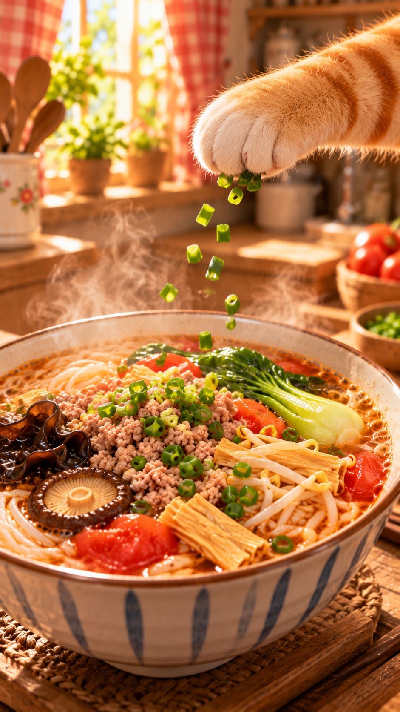

# 🍜 三鲜米线 · 小猫的米线厨房

跟着小猫，一起煮一碗热乎乎的三鲜米线。

番茄带来酸甜，香菇和木耳添一份鲜香，再搭配肉末、腐竹与蔬菜。把食材慢慢备好，把一锅热汤煮开，最后叫上朋友一起吃。

## 🧺 食材清单

食材用量按人数、食量和个人喜好调整。

| 食材 | 准备方式 |
| --- | --- |
| 米线 | 根据包装说明预处理、煮熟 |
| 干木耳 | 用清水泡发，洗净后切丝 |
| 韭菜 | 择洗干净，沥水后切成短段 |
| 干香菇 | 先冲洗再泡软，切丝；干净的香菇水留作汤底 |
| 小青菜 | 洗净，切成细条 |
| 番茄 | 洗净去蒂，切成薄片 |
| 鲜肉末 | 按喜好拌入少量调味，后续下锅煮熟 |
| 葱末 | 用于出锅后的点缀与提香 |
| 干腐竹 | 用清水泡软，确认没有硬芯后切段 |
| 豆芽 | 挑去不新鲜的部分，洗净沥水 |

### 基础调味建议

- 食用油、盐。
- 生抽、胡椒粉可按口味选择添加。
- 清水；另可使用干净、过滤后的香菇泡发水。

> 原食谱未规定食材克重和固定调味比例。以上调味及下文标明的做法为补充建议，可按口味调整，先少放、最后再尝汤。

## 🔪 一、备好食材

干木耳、干香菇和干腐竹可以提前分碗泡发；泡发方法和时间以各自包装说明为准。

### 01｜拌好肉末（补充建议）

将鲜肉末放入碗中，按喜好加入少量盐、生抽或胡椒粉，轻轻拌匀。喜欢清淡口味，也可以省略这一步的调味，最后统一调汤。

**作用：** 让肉末有一点底味。暂时不用的肉末放回冰箱冷藏。

### 02｜切韭菜

韭菜择去老叶，洗净、沥干，切成短段，放在小碗中备用。

**作用：** 方便入口，也让韭菜能均匀散在汤中；留到煮汤后段再下锅。

### 03｜泡木耳

干木耳放入清水中，按包装说明泡发。完全舒展后洗净，去掉根部较硬的部分，沥干水分。

**作用：** 让干木耳恢复柔软，便于切丝和后续烹煮。泡好后及时使用，避免长时间室温浸泡。

### 04｜切木耳

将泡好的木耳放在案板上，切成细丝，装碗备用。

**作用：** 木耳丝受热更均匀，也方便和米线一起夹起。

### 05｜泡香菇

干香菇先冲洗干净，再用干净的清水泡软。捞出香菇，将干净的香菇水留下备用。

**作用：** 泡软后容易切；香菇水可以为汤底增加菌菇香气。使用前滤去杂质，底部沉淀不要倒进锅里；有异味时弃用，改用清水。

### 06｜切香菇

去掉香菇较硬的菇柄，将泡软的香菇切成细丝。香菇丝和香菇水分开放好。

**作用：** 香菇丝稍后用于炒香，香菇水稍后用于煮汤。

### 07｜切番茄

番茄洗净去蒂，切成薄片，切出的汁水也一起留好。

**作用：** 薄片容易炒软、出汁，为汤底带来酸甜味。

### 08｜切青菜

小青菜掰开洗净，尤其注意根部夹着的泥沙。沥水后切成细条，较厚的菜梗可以切得更细一些。

**作用：** 让菜梗和菜叶更容易均匀煮熟，吃起来也方便。

### 09｜处理腐竹

干腐竹按包装说明泡软，确认中间没有硬芯后，切成方便入口的短段。

**作用：** 充分泡软的腐竹能够均匀吸收汤汁，口感更柔软。

## 🍜 二、处理米线

### 10｜煮米线

锅中烧开足量清水，加入米线并轻轻拨散，按包装要求煮熟后捞出。

**作用：** 先将米线单独煮好，之后加入汤底时只需重新加热。干米线与鲜米线的预处理方法不同，是否需要预泡、煮多久，都以包装说明为准。

### 11｜米线过凉水

将煮好的米线放入滤篮，用干净的可饮用凉水冲散，沥去多余水分。

**作用：** 冲掉部分表面淀粉，减少粘连。米线稍后还要放回热汤中重新热透。

## 🥘 三、煮一锅鲜汤

> 第 12–19 步依据现有配图补齐，为家常做法建议。这里采用肉末直接入沸汤、拨散后煮熟的方式。

### 12｜炒木耳和香菇

锅中加入少量食用油，中火加热，放入沥干的木耳丝、香菇丝，翻炒出香气。

**作用：** 先炒出菌菇香，为汤底增加鲜香。木耳表面有水时容易溅油，下锅前先沥干。

### 13｜加入番茄

将番茄片和汁水一起加入锅中，与木耳、香菇翻炒，直到番茄变软、出汁。锅里太干时，可以补少量清水。

**作用：** 把番茄的酸甜炒进汤底。

### 14｜加入香菇水，煮开汤底

倒入干净、过滤后的香菇水，再按需要补清水，煮开。水量以能盛出自己喜欢的汤量为准。

**作用：** 让香菇的鲜味和番茄的酸甜融在一起。

### 15｜放入肉末，拨散煮熟

汤煮开后，加入准备好的肉末，用筷子或勺子轻轻拨散，继续加热，确保肉末完全熟透。

**作用：** 避免肉末结成大团，让汤里均匀带上肉香。肉末充分煮熟后再继续后面的步骤。

### 16｜加入豆芽

将洗净、沥水的豆芽放入汤中，翻匀，让豆芽浸入热汤并煮熟。

**作用：** 为汤增加清甜，也让米线多一层爽脆口感。

### 17｜加入腐竹、青菜和韭菜

先放入泡软的腐竹段与青菜条，轻轻翻动，煮到腐竹热透、菜梗熟软。随后加入切好的韭菜短段，继续煮熟。

**作用：** 腐竹吸收汤汁，青菜和韭菜增添清香；韭菜后放，香味更明显。

### 18｜米线回锅

将沥干的米线放进汤锅，轻轻拨散，与肉末和蔬菜拌匀。继续加热至汤重新煮开、米线热透。

**作用：** 让米线裹上鲜汤，同时把过凉水的米线重新加热。米线已经煮熟，回锅后避免反复久煮。

### 19｜尝汤调味

确认肉末、豆芽和蔬菜都已煮熟。用干净的小勺舀一点汤，稍放凉再尝，按口味少量补盐或生抽，搅匀后再尝一次。

**作用：** 最后调整咸淡，可以把肉末原有的底味一起考虑进去，避免放盐过多。

## 🥣 四、盛碗开饭

### 20｜盛入碗中

先把米线盛入陶瓷碗，再放上肉末、木耳、香菇、腐竹和蔬菜，最后舀入热乎乎的汤。

**作用：** 配菜层次更清楚，也方便每个人都分到丰富的食材。

### 21｜撒葱花

在米线表面撒少量葱末，让热汤烘出葱香。

**作用：** 最后放葱花，颜色好看，香气也更清新。

### 22｜端上桌

用隔热垫或托盘端好汤碗，轻轻放到桌上。准备好筷子和汤匙，叫朋友一起来吃。

**作用：** 把这一碗热乎乎的家常味，分享给喜欢的人。小心烫手，入口前先稍稍放凉。

## 🐾 小猫的厨房提醒

- 干货分别泡发；只有干净、处理妥当的香菇水用于汤底，木耳和腐竹的泡发水不用来煮汤。
- 处理生肉的刀具、案板与其他食材分开使用，接触生肉后及时清洁。
- 肉末、豆芽和蔬菜要煮熟，尝汤放在食材熟透之后。
- 调味少量多次，喜欢清淡就少放盐和生抽。
- 图像为小猫主题的创意示意，具体下锅顺序以文字步骤为准。

好好吃饭，也把这份热乎分享给朋友。🍜

